# [7기] 협동로봇2 — Jazzy/24.04 개정판

> 원본(Humble/22.04) 크롤링(`72e28592`)을 현재 구현(`install.sh` + `setup-app.sh` + 컨테이너)에 맞춰 다시 쓴 버전. **self-contained** — 유효 이미지는 `images/` 에 포함(embed). 화면이 바뀐 것은 `🔄 재촬영` 로만 표기(구 이미지 미포함).
> 설치 상세 = 하위 페이지 **개발환경 설치 (Jazzy)**. 변경 근거 = `../LECTURE_MIGRATION_humble-to-jazzy.md`.

#### AI(Computer Vision) 기반 협동 로봇 작업 어시스턴트 구현 프로젝트

---

## 1. 개발 환경 구축

- **전제**: Ubuntu **24.04(noble)** + NVIDIA GPU(권장). 구 2경로(MSI 초기화 / 협동1 유지)·`Installfile_*.zip`·`a0X`/`b0X` 스크립트 **폐기**.
- **2단계로 축소**:
  1. `bash install.sh` — base 환경(kernel/NVIDIA/Docker/ROS2 Jazzy + reboot + VS Code + DDS + 정적 IP + corecode).
  2. `bash setup-app.sh` — 애플리케이션(cobot2 워크스페이스 + 컨테이너 + OPENAI key).
- **상세 절차 → 하위 페이지 "개발환경 설치 (Jazzy)"** 참조.

> 🔄 재촬영: 구 `Installfile` 압축해제·`nvidia-smi` 화면 → `install.sh [n/10]` 진행률.

---

## 2. 개발 환경 설정

#### A. `.bashrc` — **수동 편집 불필요**

- 구 버전의 `source /opt/ros/humble` · CUDA PATH · `dsr_common2/imp` PYTHONPATH · `ROS_DOMAIN_ID=99` · alias 수동 편집 **폐기**.
- 현재: DDS 튜닝 단계가 `~/.bashrc` 에 **관리 블록 자동 주입**. ROS overlay·환경 자동 로드.
- **ROS_DOMAIN_ID**: 하드코딩(99) → **설치가 정하지 않음**. 학생이 직접 `~/.bashrc` 에 `export ROS_DOMAIN_ID=<n>` 삽입(학습 과제). 미설정 시 host·컨테이너 모두 **0**(ROS2 기본)으로 매칭. 값을 바꾸면 host·양 컨테이너 동일해야 DDS 통신 성립.

> 🔄 재촬영: `.bashrc` 함수 편집 화면 → 불필요(자동화). 개념만 유지.

#### B~E. 로봇 · 네트워크 · 카메라 확인 (개념 유지)

- Doosan 공장 초기화 · TCP/Tool Weight · 홈 위치 `(0,0,90,0,90,0)`.
- 노트북 IP 설정 후 `ping 192.168.1.100`(로봇) / `ping 192.168.1.1`(RG2). 정적 IP 는 `install.sh` network step 이 설정.

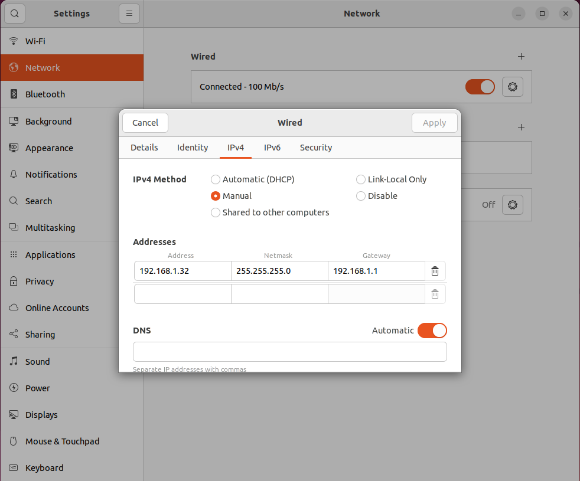
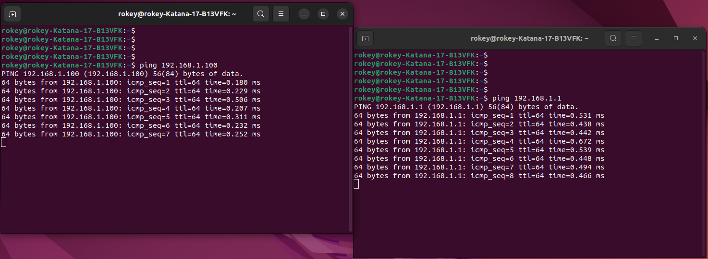

- `realsense-viewer` 로 Depth Camera 동작 확인.

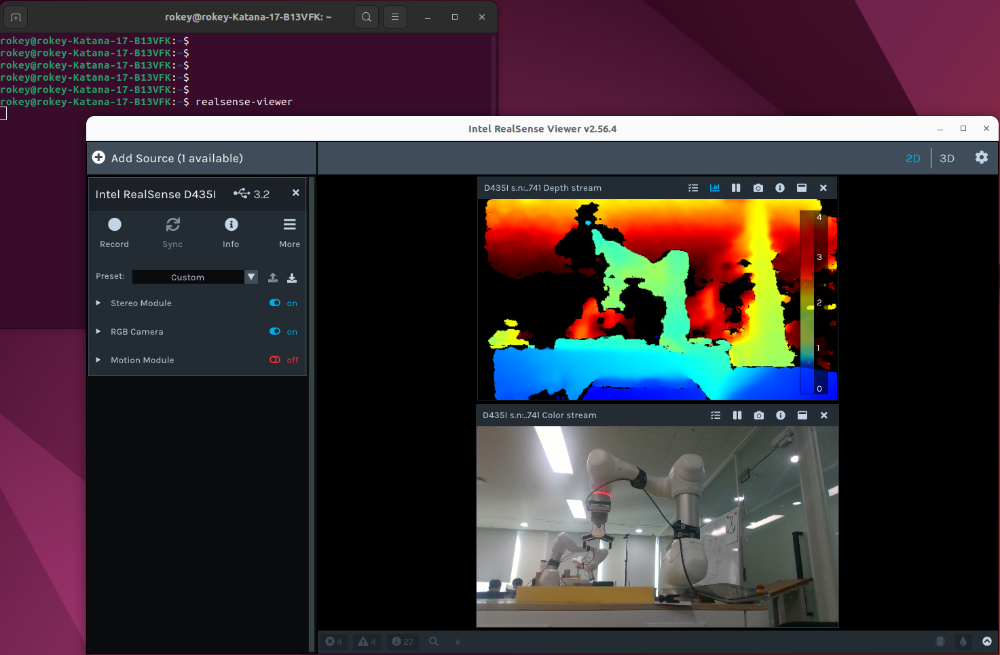

---

## 3. Core Code (Camera Calibration · Voice)

- **위치**: 구 `corecode.zip` 수동 다운로드 → 현재도 **레포 미포함** — corecode.zip 을 `~` 에 풀어 `~/corecode` 배치, `install.sh` step 10 이 확인(ADR-029).
- **구성(실제 4개)**: `Calibration_Tutorial` · `DRL_Tutorial` · `OD_Tutorial` · `VoiceProcessing`.

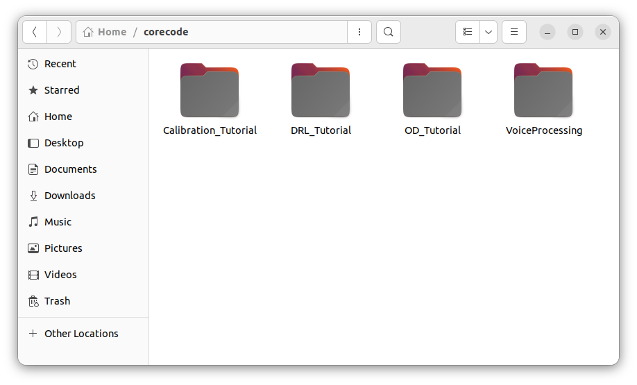

#### RG2 Gripper 작동 확인

- Modbus(onrobot `RG`, `192.168.1.1:502`) 제어. `corecode/Calibration_Tutorial/modbus.ipynb` 실행.
- **주의**: `pymodbus<3.7` 필수 — 3.7+ 는 `ModbusTcpClient` 가 serial kwargs 거부 → `onrobot.py` init `TypeError`.

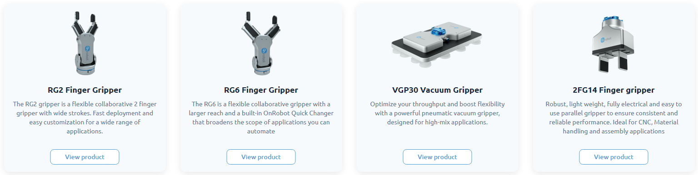

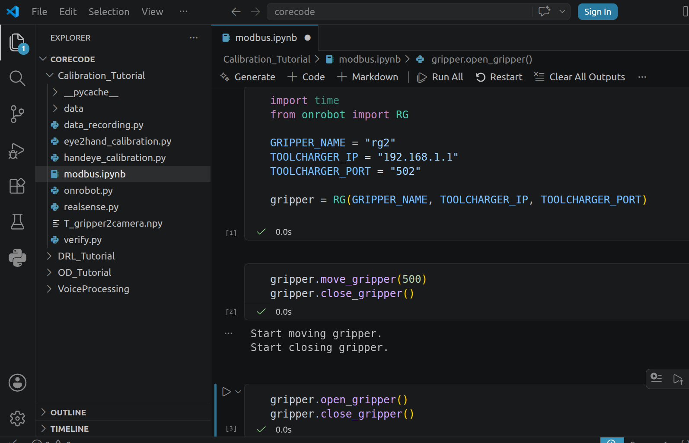

---

## 4. Camera Calibration (유지)

- eye-to-hand / hand-eye calibration, `verify.py` 흐름 그대로. 상세 = 하위 페이지 "Camera Calibration"(이론이라 승계).
- 로봇+카메라 기동은 `bash containers/bringup.sh` 로 일괄 → 별도 터미널에서 verify:

```bash
cd ~/corecode/Calibration_Tutorial
python3 verify.py
```

- 화면 클릭 → 좌표 추출 → `movel`/`open_gripper`/`close_gripper` 로 pick&place 확장(과제 유지).

---

## 5. RealSense Depth Camera (D435i) · IR (거의 유지)

- 드라이버 = **realsenseai/realsense-ros**(구 intel), apt repo·키 realsenseai 신 도메인. SDK 설치 = `setup-app.sh` RealSense 단계.
- 카메라 기동:

```bash
ros2 launch realsense2_camera rs_align_depth_launch.py \
  depth_module.depth_profile:=848x480x30 rgb_camera.color_profile:=1280x720x30 \
  align_depth.enable:=true enable_rgbd:=true pointcloud.enable:=true \
  pointcloud.stream_filter:=2 initial_reset:=true
```

- IR: 위에 `enable_infra:=true enable_infra1:=true enable_infra2:=true depth_module.emitter_enabled:=0` 추가.

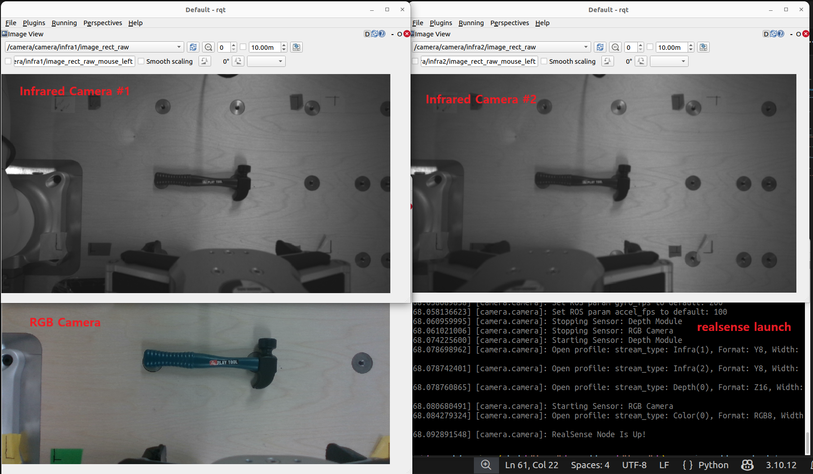
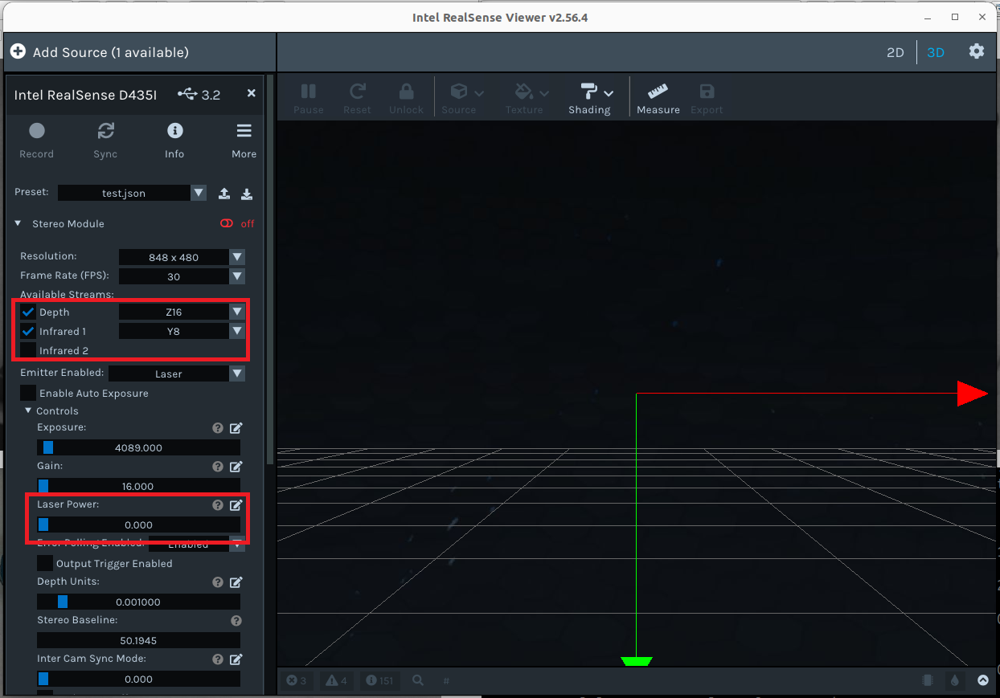

---

## 6. Voice Processing — **host** 직접 실행(ADR-027)

- 구: host 에서 `python3 mic_test.py / wakeup_word.py / STT.py / keyword_extraction.py` 직접.
- 현재: **host 직접 실행**(ADR-027) — 마이크가 하드웨어 종속(ALSA `/dev/snd` + PortAudio)이라 컨테이너 계획 철회. 앱 라이브러리(langchain/openai/openwakeword…)는 `voice-host-install.sh` 가 host system pip(`--break-system-packages`)로 설치.

```bash
source /opt/ros/jazzy/setup.bash
ros2 run voice_processing get_keyword          # host, wakeword 대기
```

```bash
# host 다른 터미널에서 STT 1회 트리거 (wakeword→5초 녹음→Whisper STT→키워드 추출)
source /opt/ros/jazzy/setup.bash
export ROS_DOMAIN_ID=0                           # bashrc 에 직접 정한 값(미설정 시 0). 컨테이너와 동일해야 함
ros2 service call /get_keyword std_srvs/srv/Trigger "{}"
# 응답 예: success=true, message='hammer / pos1'
```

- **코드 주의**: `keyword_extraction.py` = `ChatOpenAI(model="gpt-4o")`, import 는 **`from langchain_core.prompts import PromptTemplate`**(구 `langchain.prompts` 는 langchain 1.0 에서 제거).
- `numpy` 는 host voice 설치의 **`numpy<2`** 핀(구 host opencv-python numpy>=2 충돌 제거).

> 🔄 재촬영: mic/wakeword/STT/keyword host 실행 화면 유지(voice=host, ADR-027) + 통합 노드 `ros2 run … get_keyword` · `ros2 service call` 화면 추가.

---

## 7. pick and place 패키지 · 실행 구조

- **cobot2 배치**: `~/cobot_ws/src/cobot2`(레포 외부, 추적 제외). 구 `cobot_ws/src/{cobot1_ws, cobot2_ws}` 중첩 → **`cobot2` 단일**로 재편.
- **패키지 분담(3-패키지 분리)**:
  - `object_detection` + `od_msg` → **yolo 컨테이너**
  - `voice_processing` → **host**(`ros2 run voice_processing get_keyword` — 마이크 하드웨어 종속, ADR-027)
  - `robot_control` → **host** (`ros2 run robot_control robot_control`)
- 구 통합본 `pick_and_place_text`/`pick_and_place_voice` · `rokey` 유틸은 참고용.

> 아래는 구 `cobot2_ws` 구조 스샷 — **패키지 분담 개념 참고용**(ws 이름은 `cobot2` 로 재촬영 권장).

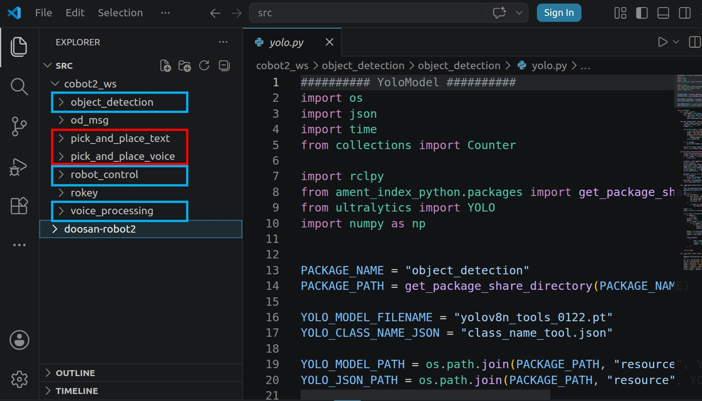

---

## 8. Object Detection (이론 유지)

- 모델 종류: Classification / **Object Detection(AABB)** / OBB / Segmentation / Instance Seg / Pose / Keypoint / Tracking / MOT — distro 무관.
- 프로젝트 모델: `yolov8n_tools_0122.pt`(+ `class_name_tool.json`), ultralytics YOLO. yolo 컨테이너 `object_detection` 노드가 host RealSense 토픽 구독 추론.
- 상세 = 하위 페이지 "AI Tutorial 복습"(이론 승계).

---

## 9. Docker & Container — **런타임 핵심**(이론→실습 승격)

- 구: 외부 링크 이론 1개. 현재: yolo/voice 실행의 기반. 필수 실습:
  - **이미지 빌드**: multi-stage `builder` 스테이지(`:dev-builder`) — `bash containers/build-all.sh`(setup-app 자동 호출).
  - **통합 실행**: `bash containers/bringup.sh`(로봇+카메라+컨테이너+노드 자동 기동, Ctrl+C 일괄 teardown).
  - **개발 루프**: 소스 live-mount + `colcon build --symlink-install` → `.py` 수정 후 노드 재실행이면 반영(재빌드 불요).
  - **개념**: `docker compose` base+dev override, `network_mode: host` + DDS(도메인·RMW·cyclonedds 일치), ENTRYPOINT vs `docker exec` 환경.

```bash
DEV="-f ~/ros2_jazzy_test/containers/docker-compose.yml -f ~/ros2_jazzy_test/containers/docker-compose.dev.yml"
docker compose $DEV up -d yolo-detection
docker logs -f yolo-detection            # "Summary: N package finished" 대기
docker exec -it yolo-detection bash
ros2 run object_detection object_detection
```

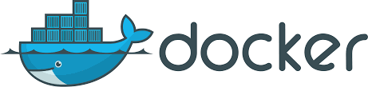

---

## 10. 협동2 CLI 명령어 (jazzy/컨테이너)

```bash
# 통합 실행 (권장)
bash containers/bringup.sh                 # virtual(emulator) + camera + containers
bash containers/bringup.sh mode:=real      # real robot
bash containers/bringup.sh mode:=virtual camera:=false

# 로봇 드라이버 직접(참고) — cobot2_bringup 이 내부에서 doosan-robot2 기동
ros2 launch cobot2_bringup bringup_all.launch.py mode:=real

# 직접 교시 전환
ros2 service call /dsr01/system/set_robot_mode dsr_msgs2/srv/SetRobotMode "robot_mode: 0"

# robot_control 노드 (host)
ros2 run robot_control robot_control
```

- `source /opt/ros/jazzy/setup.bash`(구 humble). `~/cobot_ws/install/setup.bash` overlay 자동.

---

## 11. Rokey Utility Package (유지)

- `get_cur_pos` 노드: 직접 교시하며 좌표 추출·복사(posx/posj, tk copy 버튼).
- `jog` 노드: joint/XYZ/Rx·Ry·Rz 입력 + `+/-` 키로 movej/movel·Z축 정렬.

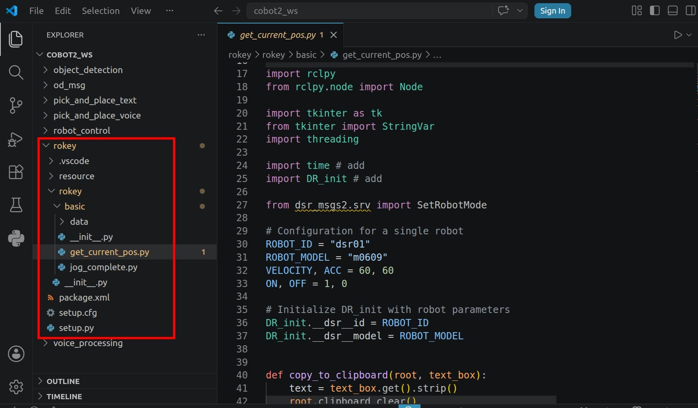
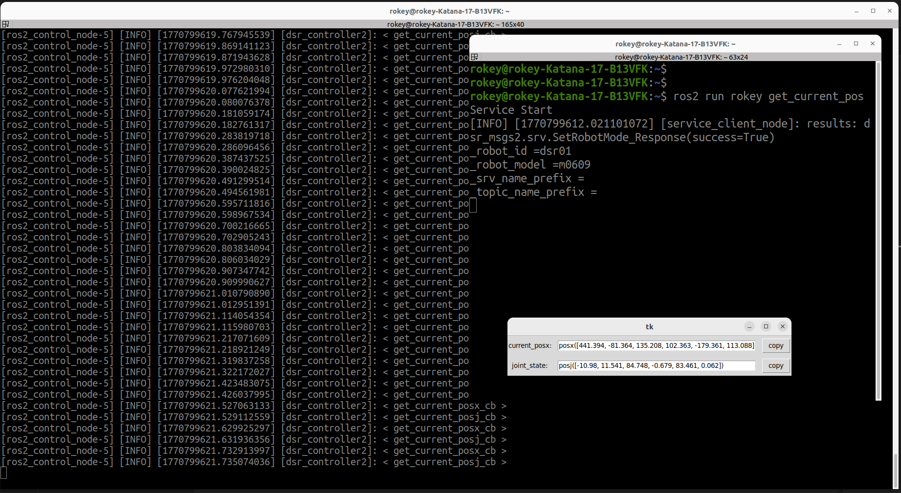
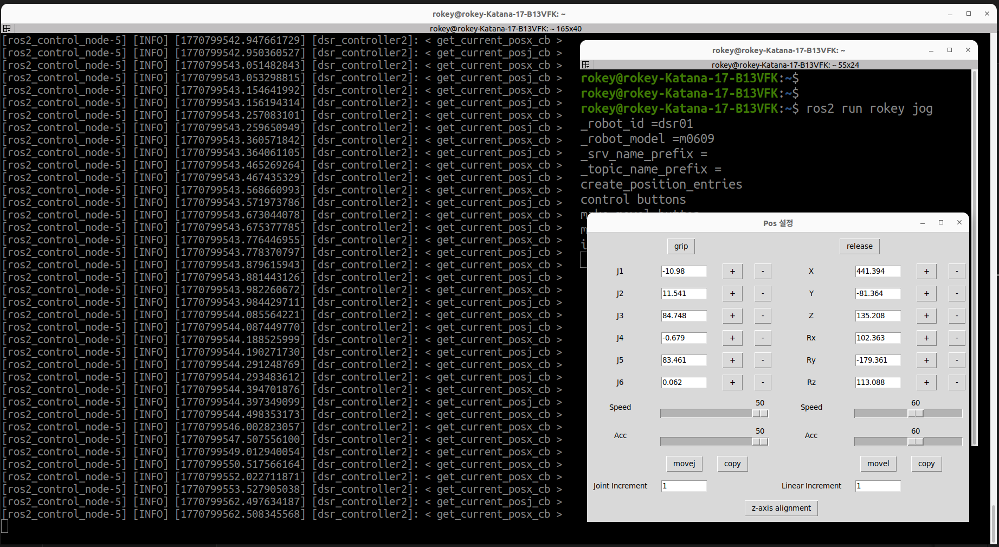

---

## 12. Doosan Bringup Topic & Service List (유지)

- `ros2 topic list` / `ros2 service list` — `/dsr01/*`. Humble/Jazzy 공통(doosan-robot2 드라이버).

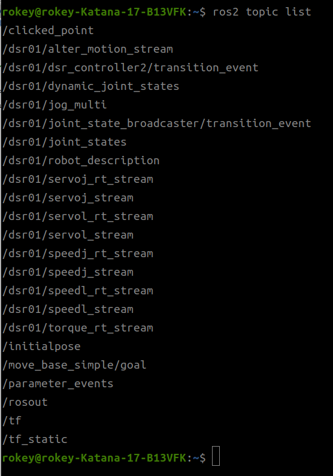
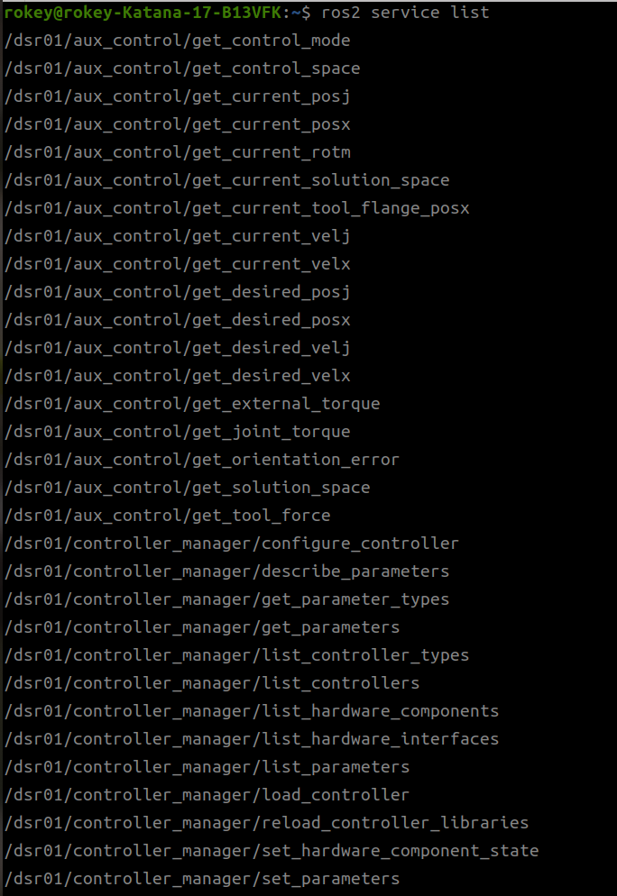
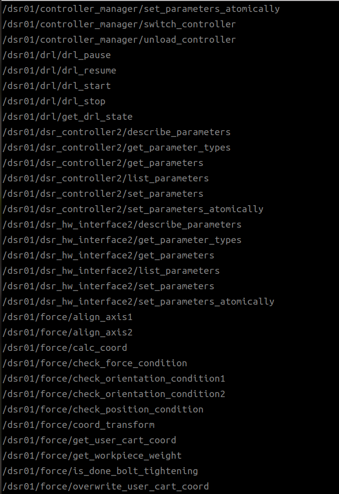
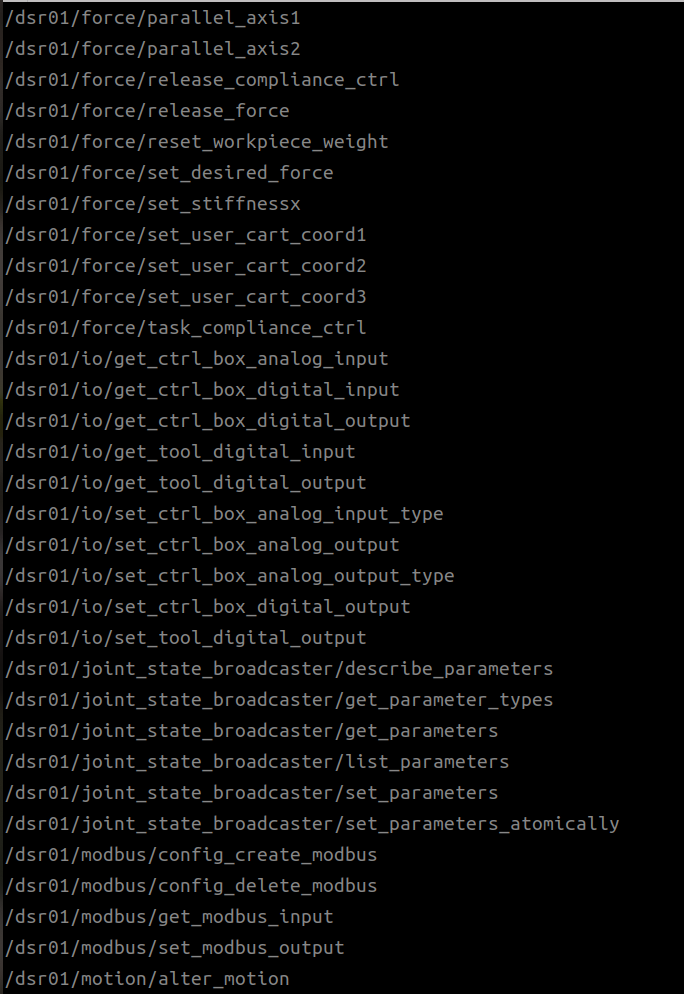
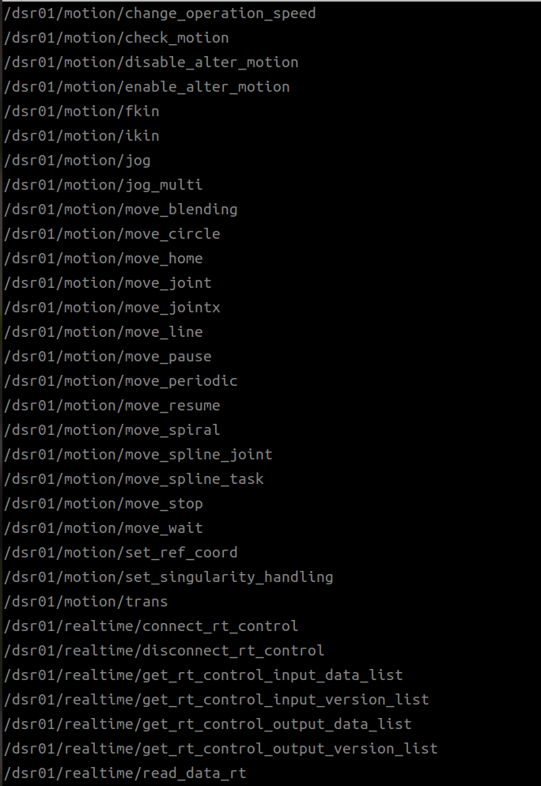
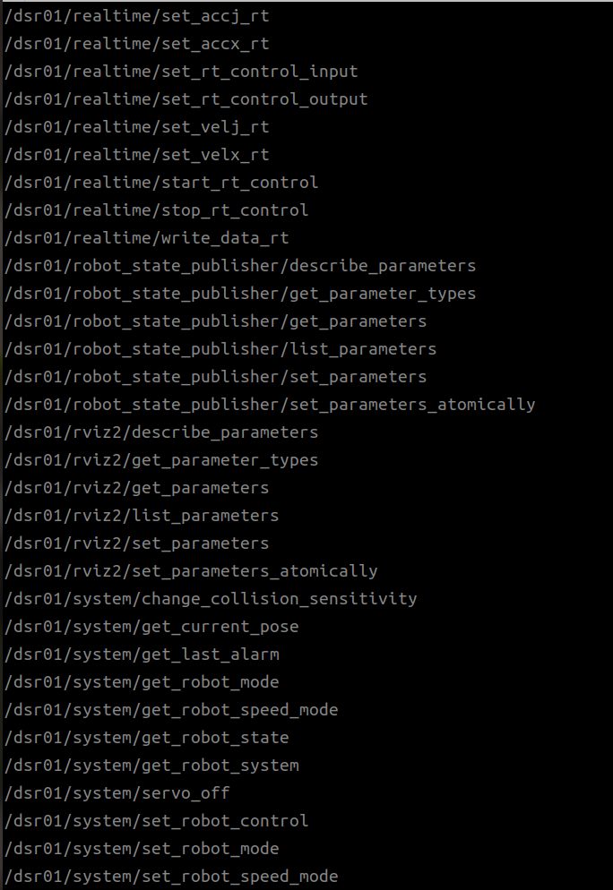
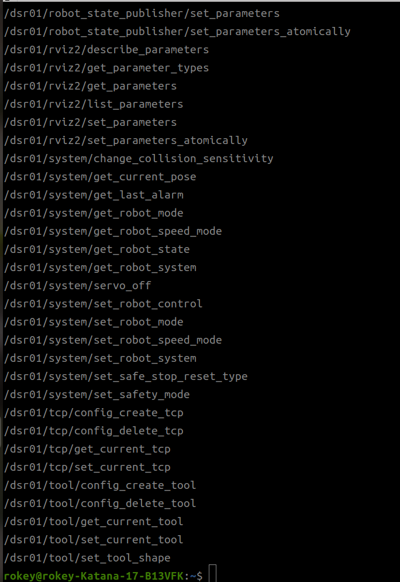

---

## 13. Others

- **Doosan 매뉴얼**: <https://robotlab.doosanrobotics.com/ko/board/Resources/Manual>
- **ROS2 매뉴얼(Jazzy)**: <https://doosanrobotics.github.io/doosan-robotics-ros-manual/jazzy/>
- **doosan-robot2**: <https://github.com/DoosanRobotics/doosan-robot2>
- **DSR_ROBOT2 Python Tutorial(Jazzy)** / **Architecture** 유지.

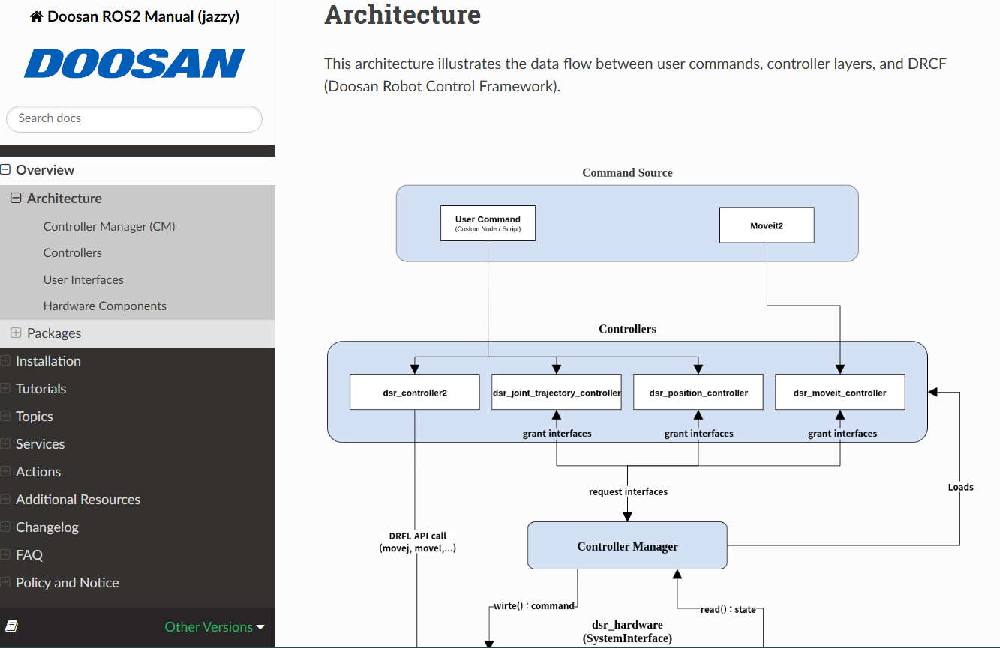
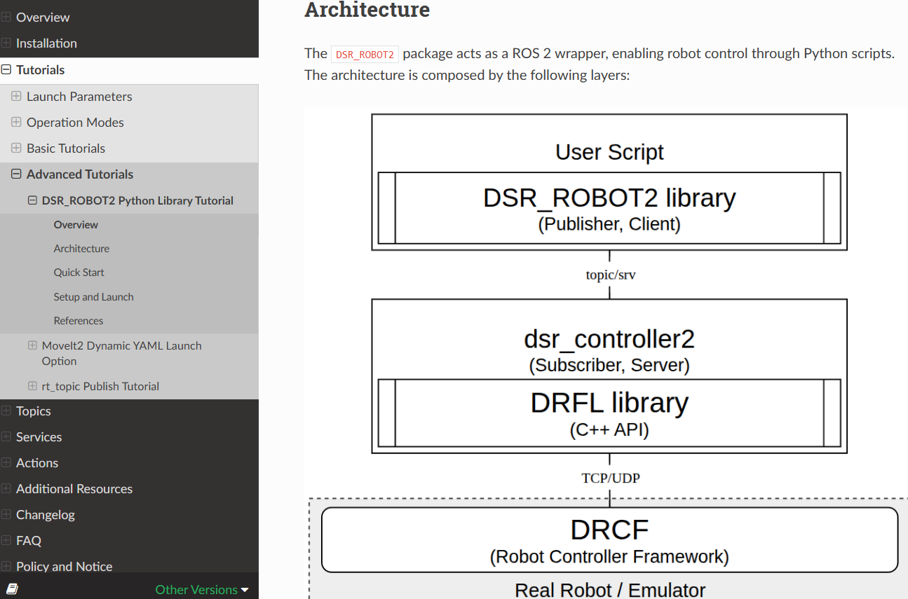

──────── [ 𝑫𝑶𝑶𝑺𝑨𝑵 𝑹𝑶𝑩𝑶𝑻𝑰𝑪𝑺 𝑹𝑶𝑲𝑬𝒀 𝑩𝑶𝑶𝑻𝑪𝑨𝑴𝑷 ] ────────
